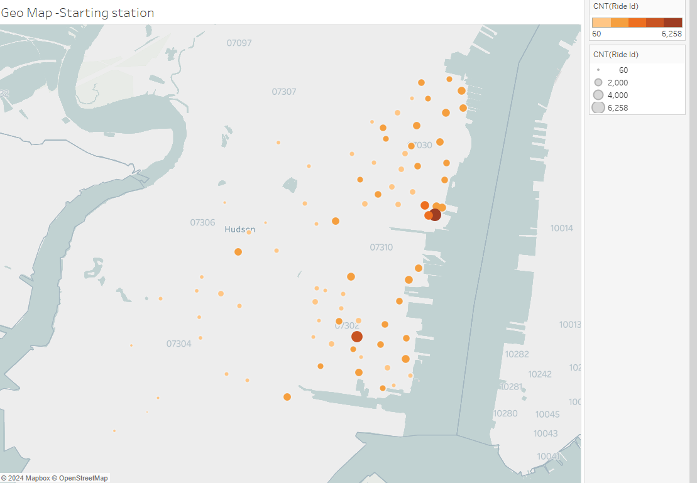

# Module_18_Tableau

Tableau Link
https://public.tableau.com/app/profile/khushboo.modha/viz/airline_17306886635950/Story1?publish=yes

https://public.tableau.com/app/profile/khushboo.modha/viz/airline_17306886635950/Story2?publish=yes

https://public.tableau.com/app/profile/khushboo.modha/viz/airline_17306886635950/Story3?publish=yes

https://public.tableau.com/app/profile/khushboo.modha/viz/airline_17306886635950/Story4?publish=yes

I downloaded Sep 2024 file from the Citi Bike Data source due to data file size restriction.

How many trips have been recorded in total during the chosen period?

The total count of the rides for Sep 2024 is 115,558.

How have the proportions of short-term customers and annual subscribers changed?

73.80% of the bike usuage are members and 26.20% are non members.

What are the peak hours when bikes are used during the month of Sep 2024?

Gradient color is used to differentiate the high and low value distinctly. A reference line is added to the average count to identify hours with above average usuage visually. The usuage is at its peak at 20.00 hour.

Today, what are the top 10 stations in the city for starting a journey? Based on data, why do you hypothesize these are the top locations?
Today, what are the bottom 10 stations in the city for starting a journey? Based on data, why?
Today, what are the bottom 10 stations in the city for ending a journey? Based on data, why?
Today, what are the bottom 10 stations in the city for ending a journey? Based on data, why?

As the data belongs to past month, I used particular date to pull the Top 10 and Bottom 10 for starting  journey and ending  jouney. The date i chose for this assignment is Sep 20, 2024.

If we look at the first bar graph Station name HB102 as starting station has highest number of rides.

How does the average trip duration based on rideable type?

The average trip duration (in mins) in case of electic bikes is less than the classic bikes.

Geo Map showing the numbder on rides for starting station

Geo Map showing the numbder on rides for Ending station

Story 1

Story 2

Story 3

Story 4

